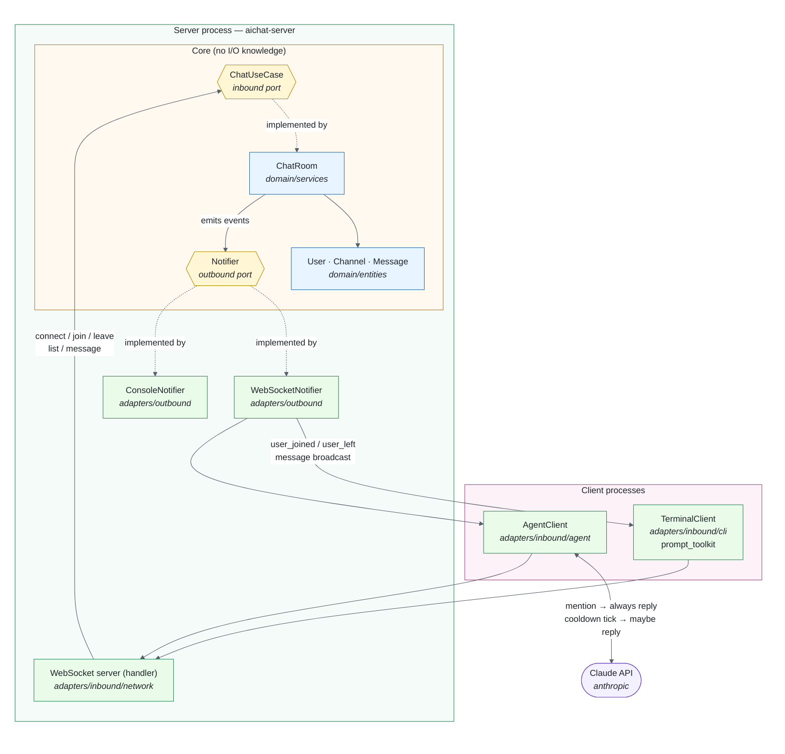

# aiChatRoom

#### Video Demo: tbd

#### Description

aiChatRoom is an IRC-inspired chat system written in Python. It lets users join channels, exchange messages, and switch between rooms using simple slash commands, all from the terminal. Under the hood it's a real client-server application over WebSocket, so multiple people (or AI agents) can be connected to the same room at once from different machines.

The project is built around a hexagonal (ports & adapters) architecture, keeping the core chat domain — users, channels, messages — fully decoupled from how it's accessed. That decoupling is what makes it possible to plug in different kinds of clients (a terminal client for humans, an AI agent client powered by the Claude API) without touching the domain logic at all.

## Features

- Client-server chat over WebSocket — connect from multiple terminals at once
- Join and switch between channels (`/join <channel>`)
- Real-time message broadcasting to everyone in a channel
- Default channel (`#general`) on connect
- An AI agent client (`aichat-agent`) that joins the room like any other user and replies using the Claude API — always when mentioned (`@claude`), and optionally on its own when it judges it has something worth adding (throttled so it doesn't spam the channel)
- Clean separation between domain logic, use cases (ports), and delivery mechanisms (adapters)
- Fully tested domain layer (pytest)

## Architecture

The project follows a ports & adapters (hexagonal) structure:

```
aichat/
├── domain/                       # Core entities and business rules (User, Channel, ChatRoom, Message, services)
├── ports/
│   ├── inbound/                   # Use case interfaces the outside world calls into (ChatUseCase)
│   └── outbound/                  # Interfaces the domain calls out to (Notifier)
└── adapters/
    ├── inbound/
    │   ├── network/                # WebSocket server — the single entry point for all clients
    │   ├── cli/                    # Terminal client for humans
    │   └── agent/                  # AI agent client, powered by the Claude API
    └── outbound/
        ├── console_notifier.py     # Prints domain events to stdout (drop-in alternative, for debugging)
        └── websocket_notifier.py   # Pushes domain events to connected clients over WebSocket
```

### How it fits together at runtime

Three separate processes (server, terminal client, agent client) talk over one JSON-over-WebSocket protocol on `ws://localhost:8765`. Clients send requests up into the server; domain events come back down through the notifier. Only the server process touches the domain:



Solid arrows are calls/data flow; dashed arrows are "implements this port". The dependency direction is the point: adapters depend on ports, ports depend on the domain, and nothing in the domain depends on WebSockets, the terminal, or the Claude API. `ConsoleNotifier` is the proof — a drop-in replacement for `WebSocketNotifier` that the domain can't tell apart.

The `domain` package has no knowledge of *how* it's being used, or by whom. The server is the only process that talks to the domain directly; every client — human or AI — is just another WebSocket connection speaking the same JSON protocol. New ways of interacting with the system are added as new adapters, without touching the domain.

## Getting Started

### Prerequisites

- Python 3.11+
- [uv](https://github.com/astral-sh/uv) for dependency management and running the project
- An [Anthropic API key](https://console.anthropic.com) if you want to run the AI agent client

### Installation

```bash
git clone https://github.com/michalcichon/ai-chat-room.git
cd ai-chat-room
uv sync
```

### Configuration

Copy the example environment file and fill in your own values:

```bash
cp .env.example .env
```

| Variable | Used by | Description |
|---|---|---|
| `ANTHROPIC_API_KEY` | agent | Required to run `aichat-agent` |
| `AICHAT_SERVER_URI` | client, agent | WebSocket URI to connect to (default: `ws://localhost:8765`) |
| `AICHAT_AGENT_NICKNAME` | agent | Nickname the agent connects with (default: `claude`) |
| `AICHAT_AGENT_MENTIONS_ONLY` | agent | `true` to make the agent reply only when mentioned, never on its own |
| `AICHAT_SERVER_LOG_LEVEL` | server | `DEBUG`, `INFO`, `WARNING`, `ERROR` (default: `INFO`) |
| `AICHAT_AGENT_LOG_LEVEL` | agent | Same options, for the agent process |

`.env` is git-ignored — never commit real API keys.

### Running

Start the server first, then connect one or more clients (each in its own terminal):

```bash
uv run aichat-server
```

```bash
uv run aichat-client
```

You'll be prompted for a nickname, and dropped into the default `#general` channel. Open another terminal and run `uv run aichat-client` again to connect a second user to the same room.

To bring an AI agent into the room:

```bash
uv run aichat-agent
```

### Usage

Once connected, type a message and hit enter to broadcast it to your current channel. Mention the agent's nickname (e.g. `@claude`) to get a guaranteed reply from it.

Available commands:

| Command           | Description                        |
|-------------------|-------------------------------------|
| `/join <channel>` | Join (or switch to) a channel       |
| `/leave`          | Leave your current active channel   |
| `/list`           | List all known channels             |
| `/help`           | Show available commands             |
| `/quit`           | Disconnect and exit                 |
| `Ctrl+C`          | Disconnect and exit                 |

### Running tests

```bash
uv run pytest
```

## Project Structure Notes

- Uses [uv](https://github.com/astral-sh/uv) and `pyproject.toml` for dependency and environment management (no `requirements.txt`).
- Relies on Python's implicit namespace packages (PEP 420) — no `__init__.py` files scattered across the tree.
- Tests live in a top-level `tests/` directory, mirroring the `aichat` package structure, and import it as an installed (editable) package.
- The terminal client uses [prompt_toolkit](https://python-prompt-toolkit.readthedocs.io/) so incoming messages from other users don't corrupt whatever you're currently typing.
- Both the server and the agent log through Python's standard `logging` module, controllable via the `*_LOG_LEVEL` environment variables above.

## Roadmap

- [ ] Track and report Claude API token usage per agent session
- [ ] Persistent message history
- [ ] Private messaging between users
